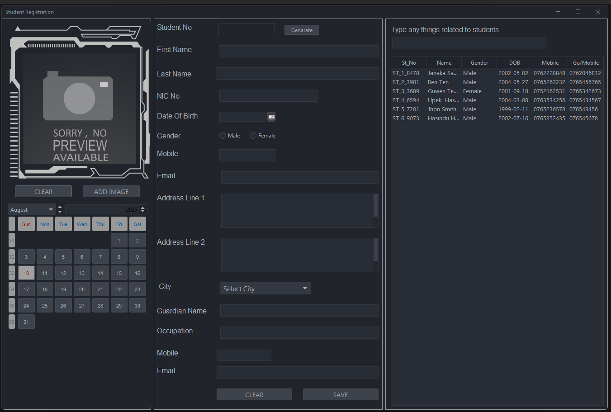

# Adyapana Institute - School Management System


A comprehensive School Management System built with Java Swing and MySQL for Adyapana Institute. This desktop application provides complete administrative functionality for managing students, teachers, classes, attendance, payments, and generating reports with a modern, user-friendly interface.

## 📋 Table of Contents
- [Features](#features)
- [Screenshots](#screenshots)
- [Prerequisites](#prerequisites)
- [Installation](#installation)
- [Database Setup](#database-setup)
- [Usage](#usage)
- [Project Structure](#project-structure)
- [Technologies Used](#technologies-used)
- [Reports](#reports)
- [Themes](#themes)
- [Contributing](#contributing)
- [License](#license)

## ✨ Features

### 🔐 Authentication & Security
- **Admin Login System**: Secure multi-admin login with role-based access
- **Admin Type Selection**: Different administrative roles with specific permissions
- **Session Management**: Secure user session handling

### 👥 Student Management
- **Student Registration**: Complete student profile management with photo upload
- **Personal Information**: Store NIC, DOB, gender, contact details
- **Student Search & Filter**: Advanced search and filtering capabilities
- **Student Records**: Comprehensive student database management
- **Photo Management**: Student profile picture upload and storage

### 👨‍🏫 Teacher Management
- **Teacher Registration**: Comprehensive teacher profile management
- **Teacher Enrollment**: Subject-wise teacher assignments
- **Qualification Management**: Store teacher credentials and experience
- **Contact Information**: Complete teacher contact database

### 📚 Academic Management
- **Class Registration**: Create and manage different class types and schedules
- **Subject Registration**: Add and manage academic subjects
- **Student-Teacher Enrollment**: Link students with teachers and subjects
- **Class Scheduling**: Organize classes by days and time slots

### 📊 Attendance Management
- **Student Attendance**: Mark and track daily student attendance
- **Attendance Reports**: Generate attendance reports for students
- **Date-wise Tracking**: Monitor attendance patterns over time
- **Bulk Attendance**: Efficient class-wise attendance marking

### 💳 Payment Management
- **Fee Collection**: Manage student fee payments
- **Payment Tracking**: Track payment history and pending dues
- **Invoice Generation**: Automated fee invoice creation
- **Payment Reports**: Comprehensive payment reporting system

### 📈 Reporting System
- **Fee Invoices**: Generate detailed fee invoices using JasperReports
- **Attendance Reports**: Student attendance summary reports
- **Custom Reports**: Flexible reporting with various parameters
- **Export Options**: Print and save reports in multiple formats

### 🎨 Modern UI/UX
- **FlatLaf Theme Support**: Modern flat design themes
- **Multiple Theme Options**: 
  - Arc Dark Theme
  - Carbon Theme
  - Gradianto Deep Ocean
  - Nord Theme
  - One Dark Theme
- **Responsive Design**: Adaptive UI components
- **Date/Time Widgets**: Interactive calendar and time picker components

## 📸 Screenshots

### Login Interface


### Main Dashboard


### Student Registration


### Teacher Management


### Class Management


### Attendance System


### Payment Management


## 🔧 Prerequisites

Before running this application, ensure you have the following installed:

- **Java Development Kit (JDK) 8 or higher**
- **MySQL Server 8.0 or higher**
- **NetBeans IDE** (recommended for development)
- **MySQL Workbench** (optional, for database management)

## 📦 Installation

### 1. Clone the Repository
```bash
git clone https://github.com/janak-dev2002/Adyapana-Institute-SAD-Project.git
cd Adyapana_Institute
```

### 2. Database Setup
1. Start your MySQL server
2. Create a new database named `adyapana_institute_db`
3. Import the database schema using the provided SQL file:
   ```bash
   # Using MySQL command line
   mysql -u your_username -p adyapana_institute_db < DB/adyapana_institute_db.sql
   
   # Or using MySQL Workbench:
   # 1. Open MySQL Workbench
   # 2. Connect to your MySQL server
   # 3. Go to Server > Data Import
   # 4. Select "Import from Self-Contained File"
   # 5. Choose the file: DB/adyapana_institute_db.sql
   # 6. Select "adyapana_institute_db" as target schema
   # 7. Click "Start Import"
   ```
4. Update database credentials in `src/model/MySQL.java`:
   ```java
   connection = DriverManager.getConnection(
       "jdbc:mysql://localhost:3306/adyapana_institute_db",
       "your_username", 
       "your_password"
   );
   ```

### 3. Dependencies
The project includes all necessary JAR files in the `lib/` directory:
- MySQL Connector J (8.0.33)
- FlatLaf (3.1.1) - Modern look and feel
- JasperReports (6.20.5) - Report generation
- JCalendar (1.4) - Date picker component
- Commons libraries for various utilities

### 4. Build and Run
1. Open the project in NetBeans IDE
2. Clean and build the project
3. Run the main application

## 🗃️ Database Setup

The project includes a complete database schema file located at `DB/adyapana_institute_db.sql`. This file contains all the necessary table structures and initial data required for the application.

### Database Schema Includes:
- **Admin users table**: For authentication and role management
- **Students table**: Complete student information storage
- **Teachers table**: Teacher profiles and qualifications
- **Classes table**: Class schedules and information
- **Subjects table**: Academic subject management
- **Attendance table**: Student attendance tracking
- **Payments table**: Fee payment records
- **Cities table**: Address management support

### Quick Setup:
1. Ensure MySQL server is running
2. Create database: `CREATE DATABASE adyapana_institute_db;`
3. Import schema: Use the `DB/adyapana_institute_db.sql` file
4. Update connection credentials in `MySQL.java`

## 🚀 Usage

### Starting the Application
1. Launch the application
2. Select admin type from dropdown
3. Enter username and password
4. Access the main dashboard

### Key Workflows

#### Student Management
1. Navigate to Student Registration
2. Fill in student details and upload photo
3. Save student record
4. Use search functionality to find students

#### Teacher Management
1. Go to Teacher Enrollment
2. Register teacher with qualifications
3. Assign subjects to teachers
4. Manage teacher schedules

#### Attendance Tracking
1. Open Student Attendance module
2. Select class and date
3. Mark attendance for each student
4. Generate attendance reports

#### Payment Processing
1. Access Student Payments
2. Record fee payments
3. Generate invoices
4. Track payment history

## 📁 Project Structure

```
Adyapana_Institute/
├── src/
│   ├── gui/                    # User Interface Classes
│   │   ├── Admin_login.java    # Login interface
│   │   ├── MainUI.java         # Main dashboard
│   │   ├── Student_Registration.java
│   │   ├── Teacher_Enrolment.java
│   │   ├── Class_registration.java
│   │   ├── subject_registration.java
│   │   ├── Student_Attendence.java
│   │   ├── Student_payments.java
│   │   └── Student_Teacher_Enrol.java
│   ├── model/                  # Data Models & Database
│   │   ├── MySQL.java          # Database connection
│   │   ├── Students.java       # Student data model
│   │   ├── Teachers.java       # Teacher data model
│   │   ├── Payment.java        # Payment data model
│   │   ├── Invoice.java        # Invoice generation
│   │   └── Student_Attend.java # Attendance model
│   ├── reports/                # JasperReports Templates
│   │   ├── feesInvoice.jasper  # Fee invoice template
│   │   └── Stu_Attendance.jasper # Attendance report
│   ├── themes/                 # UI Themes
│   │   ├── arc_theme_dark.theme.json
│   │   ├── Carbon.theme.json
│   │   ├── Gradianto_deep_ocean.theme.json
│   │   ├── nord.theme.json
│   │   └── one_dark.theme.json
│   └── assetes/
│       └── img/                # Application images/icons
├── lib/                        # External Libraries
├── screenshots/                # Application Screenshots
├── build/                      # Compiled classes
├── nbproject/                  # NetBeans project files
└── README.md
```

## 🛠️ Technologies Used

### Core Technologies
- **Java SE**: Core programming language
- **Java Swing**: GUI framework for desktop interface
- **MySQL**: Relational database management
- **JDBC**: Database connectivity

### External Libraries
- **FlatLaf**: Modern Look and Feel for Swing applications
- **JasperReports**: Professional report generation
- **MySQL Connector/J**: MySQL database driver
- **JCalendar**: Date picker component
- **Apache Commons**: Utility libraries
- **TimingFramework**: Animation support

### Development Tools
- **NetBeans IDE**: Primary development environment
- **MySQL Workbench**: Database design and management
- **Git**: Version control system

## 📊 Reports

The system generates professional reports using JasperReports:

### Available Reports
1. **Fee Invoices**: Detailed student fee invoices with institute branding
2. **Attendance Reports**: Student attendance summaries with date ranges
3. **Custom Reports**: Extensible reporting framework for additional reports

### Report Features
- Professional formatting
- Institute branding and logos
- Export to PDF format
- Print functionality
- Date range filtering
- Student-specific reports

## 🎨 Themes

The application supports multiple modern themes powered by FlatLaf:

1. **Arc Dark Theme**: Dark theme with blue accents
2. **Carbon Theme**: Professional dark theme
3. **Gradianto Deep Ocean**: Ocean-inspired gradient theme
4. **Nord Theme**: Minimalist Nordic color palette
5. **One Dark Theme**: Popular developer-friendly dark theme

Users can switch themes from the application settings for a personalized experience.

## 🤝 Contributing

1. Fork the repository
2. Create a feature branch (`git checkout -b feature/AmazingFeature`)
3. Commit your changes (`git commit -m 'Add some AmazingFeature'`)
4. Push to the branch (`git push origin feature/AmazingFeature`)
5. Open a Pull Request

### Development Guidelines
- Follow Java naming conventions
- Comment your code appropriately
- Test thoroughly before submitting
- Maintain consistent code formatting

## 📋 Future Enhancements

- **Web Interface**: Develop a web-based version
- **Mobile App**: Create mobile applications for teachers and students
- **SMS/Email Integration**: Automated notifications
- **Online Payment Gateway**: Integrate payment gateways
- **Advanced Analytics**: Dashboard with charts and analytics
- **Backup & Recovery**: Automated database backup system

## 📝 License

This project is developed for educational purposes as part of the Software Application Development (SAD) course assignment.

## 👨‍💻 Developer

**Name**: Janaka Sangeeth  
**Course**: Software Application Development (SAD)  
**Assignment**: Assignment 2 - School Management System  
**Institute**: Java Institute

---
